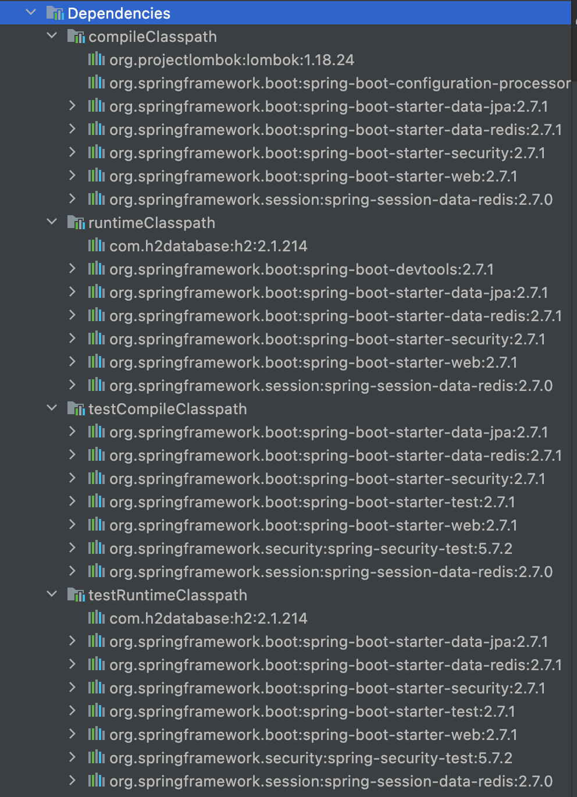

# Gradle Dependency Configurations

See References below:
- [https://docs.gradle.org/current/userguide/declaring_dependencies.html](https://docs.gradle.org/current/userguide/declaring_dependencies.html)
- [https://docs.gradle.org/current/userguide/java_plugin.html#sec:java_plugin_and_dependency_management](https://docs.gradle.org/current/userguide/java_plugin.html#sec:java_plugin_and_dependency_management)

---

## Classpath

JVM이 프로그램을 실행할 때, 클래스 파일을 찾기 위해 기준이 되는 파일 경로를 의미한다.

- `compileClasspath`는 에러 없이 컴파일 하기 위해 필요한 클래스들의 위치를 의미한다.
- `runtimeClasspath`는 애플리케이션이 런타임에 정상적으로 실행되기 위해 필요한 클래스들의 경로이다.

## Dependency Configurations

- `compileOnly`: Compile-time에만 사용하는 dependency로 runtime에는 사용하지 않는다.
- `implementation`: 구현에 필요한 종속성을 사용하도록 한다.
- `runtimeOnly`: runtime에만 사용하는 dependency이다.
- `annotationProcessor`: Annotation Processor로써 컴파일 타임에 사용되는 의존성을 주입한다.
- `api`: Gradle 6 이후 `compile`이 deprecated (7 버전부터 제거됨)되면서 replace된 키워드로 기존 `compile`과 역할이 동일하다. `implementation`과 다르게 `api`로 의존하는 종속성의 종속성까지 함께 빌드한다. 이 경우 직접적으로 종속성의 하위 종속성을 사용하지 않는다면 불필요한 API들이 전부 빌드되므로 시간적으로 비효율적이다. 

앞에 `test`가 붙으면 테스트에 대해 한정된다.
