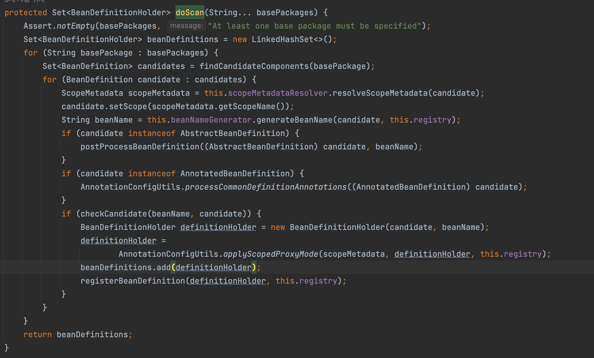

- @Component Annotation
```java
@Target({ElementType.TYPE})
@Retention(RetentionPolicy.RUNTIME)
@Documented
@Indexed
public @interface Copmonent {
    String value() default "";
}
```


J2SE 5.0부터 annotation을 작성할 떄는 [`java.lang.annotation`](https://docs.oracle.com/javase/8/docs/api/java/lang/annotation/package-summary.html) 패키지 내 4가지 Annotation을 이용해 작성한다.

- `@Documented`
    - javadoc 문서화 여부
- `@Retention`
    - annotation의 지속시간
    - `RetentionPolicy.SOURCE`
        - 컴파일 후에 정보가 사라짐
        - 바이트코드에 기록되지 않음
    - `RetentionPolicy.CLASS`
        - default 값
        - 컴파일 타임 때만 `.class` 파일에 존재하고 런타임에는 없어짐
    - `RetentionPolicy.RUNTIME`
        - 런타임 시에도 `.class` 파일에 존재하며 **Custom Annotation을 만들 때 주로 사용하고, Reflection 사용 가능.**
- `@Target`
    - Annotation을 작성할 곳
    - default : 모든 대상
    - `ElementType.TYPE`
        - `class`, `interface`, `enum`
    - `ElementType.FIELD`
        - instance variable
    - `ElementType.METHOD`
    - `ElementType.PARAMETER`
    - `ElementType.CONSTRUCTOR`
    - `ElementType.LOCAL_VARIABLE`
    - `ElementType.ANNOTATION_TYPE`
        - or other annotations
    - `ElementType.PACKAGE`
- `@Inherited`
    - 자식 클래스에 상속 여부 결정

## Custom Annotation

```java
@Target(ElementType.METHOD)
@Retention(RetentionPolicy.RUNTIME)
@Documented
public @interface HasResourcePermission {
    String authority default "";
}
```

```java
public class AuthorityUtil {
    public static void hasPermission(Class<?> clazz) {
        Authentication authentication = userService.getAuthentication();

        Field[] fields = clazz.getDeclaredFields();
        for (Field field: fields) {
            if (field.isAnnotationPresent(HasResourcePermission.class)) {
                // 처리 로직
            }
        }
    }
}
```
- annotation type은 `@interface`로 정의한다.
- 자동으로 `java.lang.Annotation` 인터페이스를 상속하고, 이외 다른 클래스 혹은 인터페[이스 상속을 받을 수 없다.
- 파라미터 접근자는 `public` 이거나 `default`이어야 한다.
- 파라미터 멤버는 Primitive type과 `String`, `Enum`, `Class`, `Annotation`만 사용 가능하다.
- 클래스 메서드와 필드에 관한 Annotation 정보가 필요하다면 `Reflection`을 활용할 수 있다. (다른 방법으로는 불가함)

## Spring에서의 Annotation

- `Component` 와 같은 Annotation이 사용된 클래스가 `Bean`으로 등록된다.

### ClassPathBeanDefinitionScanner.doScan

