# Spring Security Architecture / Code Analysis

Spring Security는 Servlet Filter의 구현체들로 Filter Chain을 구성해 인증과 인가를 처리합니다.

## Architecture

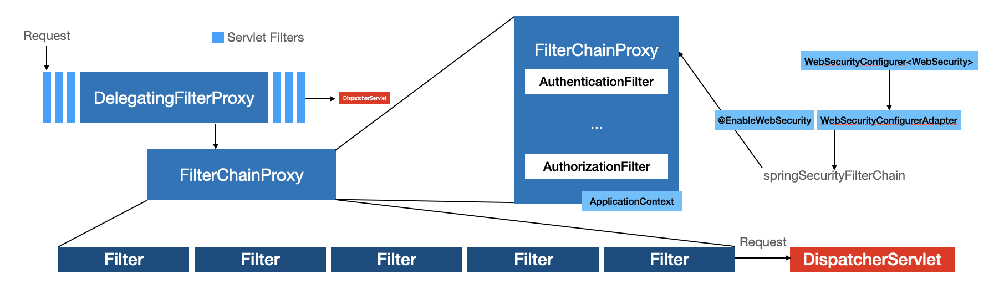

### DelegatingFilterProxy / FilterChainProxy

- Servlet Filter 사이에 삽입된 `DelegatingFilterProxy` 는 Servlet Container Lifecycle과 Spring `ApplicationContext` 를 연결합니다.
  - Spring Boot를 사용하는 경우 `SecurityFilterAutoConfiguration`을 통해 자동 설정됨.
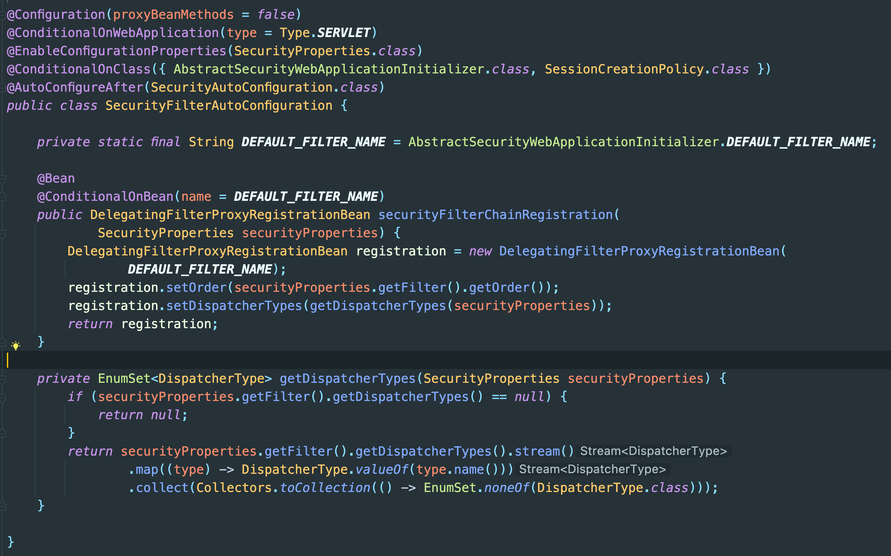
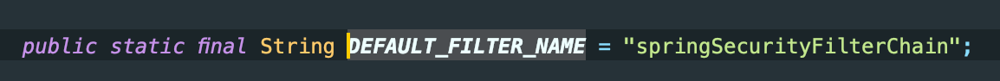
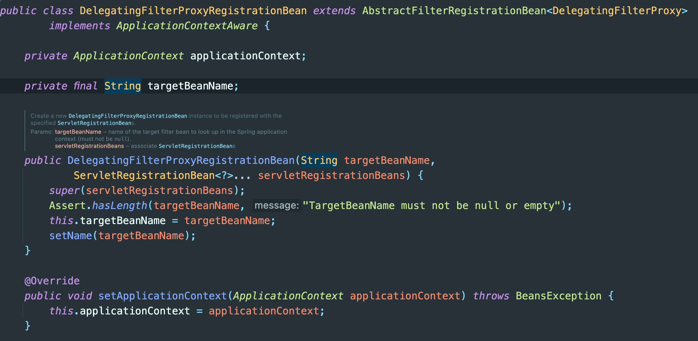
  - 서블릿 컨테이너는 자체 표준을 사용해 `Filter`를 등록하지만 Spring Bean은 인식하지 못함.
  - `DelegatingFilterProxy`는 표준 서블릿 컨테이너 매커니즘으로 등록할 수 있으면서도 모든 처리를 `Filter`를 구현한 Spring Bean으로 위임할 수 있음.
  - `DelegatingFilterProxy`는 `ApplicationContext`의 Bean Filter를 찾아 실행합니다.
  -  `DelegatingFilterProxy`를 사용하면 `Filter` Bean 인스턴스 참조를 지연시킬 수 도 있다. (컨테이너가 기동 전 `Filter`를 등록해야 하기 때문에 중요한 기능. Spring은 보통 `Filter` 인스턴스를 등록하는 시점 이후에 필요한 Spring Bean을 `ContextLoaderListener`로 로드함.)

```java
// DelegatingFilterProxy.doFilter

@Override
public void doFilter(ServletRequest request, ServletResponse response, FilterChain filterChain)
        throws ServletException, IOException {

    // Lazily initialize the delegate if necessary.
    Filter delegateToUse = this.delegate;
    if (delegateToUse == null) {
        synchronized (this.delegateMonitor) {
            delegateToUse = this.delegate;
            if (delegateToUse == null) {
                WebApplicationContext wac = findWebApplicationContext();
                if (wac == null) {
                    throw new IllegalStateException("No WebApplicationContext found: " +
                            "no ContextLoaderListener or DispatcherServlet registered?");
                }
                delegateToUse = initDelegate(wac);
            }
            this.delegate = delegateToUse;
        }
    }

    // Let the delegate perform the actual doFilter operation.
    invokeDelegate(delegateToUse, request, response, filterChain);
}
```

> `WebSecurity.java - performBuild()`
> 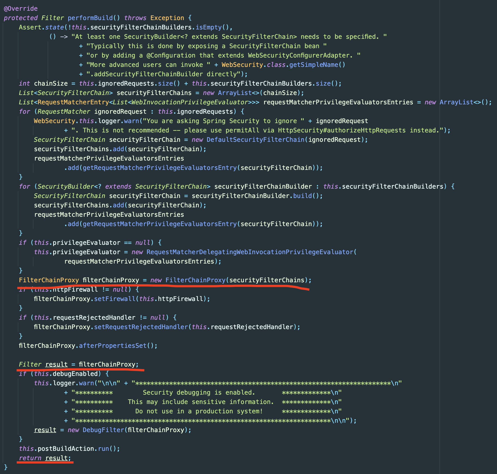

- `FilterChainProxy`는 Spring Security가 제공하는 특별한 `Filter`로, `springSecurityFilterChain`을 통해 여러 `Filter` 인스턴스로 위임할 수 있습니다. Spring Bean이기 때문에 `DelegatingFilterProxy`로부터 위임받아 동작합니다.
  - 이 때 요청에 사용할 `Filter`를 사용할 땐 `springSecurityFilterChain`을 사용하며 개발자가 Config 구성을 통해 직접 선택하도록 할 수 있습니다.

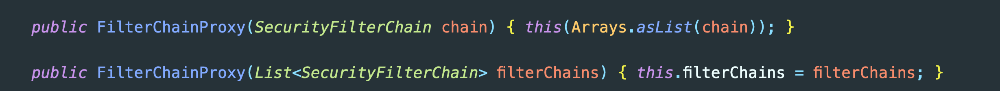

- `FilterChainProxy`에 추가되는 `Filter`들은 순서가 있으며 사용자 요청이 각 `Filter`를 순서대로 거쳐가므로 중요하다.

### Configuration

`WebSecurityConfigurerAdapter`를 상속받은 클래스에 `@EnableWebSecurity` annotation을 포함시키면 자동으로 `springSecurityFilterChain`이 포함됩니다.

```java
import org.springframework.beans.factory.annotation.Autowired;

import org.springframework.context.annotation.*;
import org.springframework.security.config.annotation.authentication.builders.*;
import org.springframework.security.config.annotation.web.configuration.*;

@EnableWebSecurity
public class SecurityConfig extends WebSecurityConfigurerAdapter {

  ...

}
```

- 구현하려는 서비스 특성에 맞게 인증과 인가 설정을 할 수 있습니다.

### Authentication

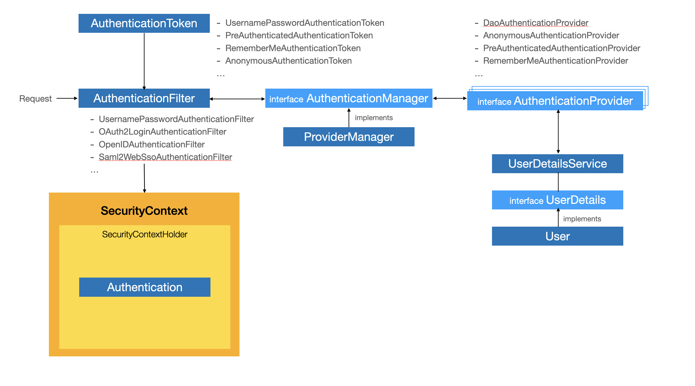

인증은 다음과 같은 절차를 통해 수행됩니다.
- Request가 구현하려는 로그인 방식에 따른 `AuthenticationFilter` 를 거쳐 `AuthenticationToken`을 생성합니다.
  - Default인 `UsernamePasswordAuthenticationFilter`에서는 request로부터 `username`과 `password` 파라미터를 파싱해 `UsernameAuthenticationToken`을 생성합니다.
  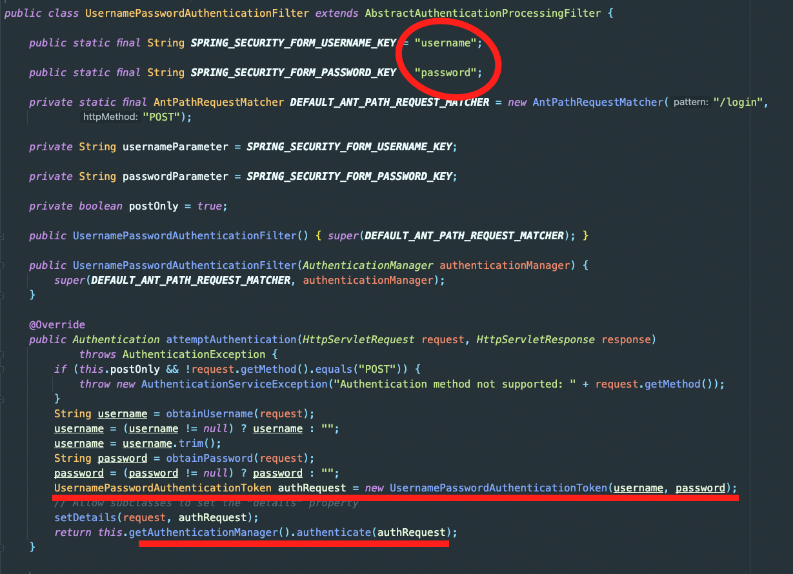
- 생성된 `AuthenticationToken`은 유효한 Principal인지 증명하기 위해 검증 과정을 거칩니다.
  - `AuthenticationManager`가 `authenticate()` 메서드를 호출해서 유효한 주체인지 검증을 진행합니다.
  - `AuthenticationManager`는 인터페이스이며 구현체인 `ProviderManager`가 이를 구현합니다.
  - 로그인 방식에 따라 검증 방식이 달라지기 때문에 `ProviderManager`는 `AuthenticationProvider`를 구현하는 로그인 방식별 Provider를 검증을 위임합니다.
  ```java
  // ProviderManager.authenticate

  @Override
	public Authentication authenticate(Authentication authentication) throws AuthenticationException {
		Class<? extends Authentication> toTest = authentication.getClass();
		AuthenticationException lastException = null;
		AuthenticationException parentException = null;
		Authentication result = null;
		Authentication parentResult = null;
		int currentPosition = 0;
		int size = this.providers.size();
		for (AuthenticationProvider provider : getProviders()) {
			if (!provider.supports(toTest)) {
				continue;
			}
			if (logger.isTraceEnabled()) {
				logger.trace(LogMessage.format("Authenticating request with %s (%d/%d)",
						provider.getClass().getSimpleName(), ++currentPosition, size));
			}
			try {
				result = provider.authenticate(authentication);
				if (result != null) {
					copyDetails(authentication, result);
					break;
				}
			}
			catch (AccountStatusException | InternalAuthenticationServiceException ex) {
				prepareException(ex, authentication);
				// SEC-546: Avoid polling additional providers if auth failure is due to
				// invalid account status
				throw ex;
			}
			catch (AuthenticationException ex) {
				lastException = ex;
			}
		}
		if (result == null && this.parent != null) {
			// Allow the parent to try.
			try {
				parentResult = this.parent.authenticate(authentication);
				result = parentResult;
			}
			catch (ProviderNotFoundException ex) {
				// ignore as we will throw below if no other exception occurred prior to
				// calling parent and the parent
				// may throw ProviderNotFound even though a provider in the child already
				// handled the request
			}
			catch (AuthenticationException ex) {
				parentException = ex;
				lastException = ex;
			}
		}
		if (result != null) {
			if (this.eraseCredentialsAfterAuthentication && (result instanceof CredentialsContainer)) {
				// Authentication is complete. Remove credentials and other secret data
				// from authentication
				((CredentialsContainer) result).eraseCredentials();
			}
			// If the parent AuthenticationManager was attempted and successful then it
			// will publish an AuthenticationSuccessEvent
			// This check prevents a duplicate AuthenticationSuccessEvent if the parent
			// AuthenticationManager already published it
			if (parentResult == null) {
				this.eventPublisher.publishAuthenticationSuccess(result);
			}

			return result;
		}

		// Parent was null, or didn't authenticate (or throw an exception).
		if (lastException == null) {
			lastException = new ProviderNotFoundException(this.messages.getMessage("ProviderManager.providerNotFound",
					new Object[] { toTest.getName() }, "No AuthenticationProvider found for {0}"));
		}
		// If the parent AuthenticationManager was attempted and failed then it will
		// publish an AbstractAuthenticationFailureEvent
		// This check prevents a duplicate AbstractAuthenticationFailureEvent if the
		// parent AuthenticationManager already published it
		if (parentException == null) {
			prepareException(lastException, authentication);
		}
		throw lastException;
	}
  ```

- DAO로 인증하는 경우 `DaoAuthenticationProvider`를 통해 검증을 수행합니다.
  - `UserDetails`를 구현한 `User`를 생성하고 `UserDetailsService`의 구현체를 구현해 Provider에서 `User` 정보를 가져올 수 있게 구현합니다.
  ```java
  // ServiceUser.java

  import org.springframework.security.core.authority.AuthorityUtils;
  import org.springframework.security.core.userdetails.User;

  public class ServiceUser extends User {
      public ServiceUser(DaoUser user) {
          super(user.getId(), user.getPassword(), AuthorityUtils.createAuthorityList(user.getRole().name()));
      }
  }
  ```

  ```java
  // ServiceUserDetailsService.java

  @Service
  @RequiredArgsConstructor
  public class ServiceUserDetailsService implements UserDetailsService {

      private static final String EXCEPTION_USERNAME_NOT_FOUND_MESSAGE = "해당 사용자 정보는 존재하지 않습니다.";
      private final ServiceUserRepository serviceUserRepository;

      @Override
      public UserDetails loadUserByUsername(String username) throws UsernameNotFoundException {
          ServiceUser serviceUser = serviceUserRepository.findById(username)
                                                .orElseThrow(() -> new UsernameNotFoundException(EXCEPTION_USERNAME_NOT_FOUND_MESSAGE));
          return new ServiceUser(serviceUser);
      }
  }
  ```

  ```java
  // In your Security Config,
  
  @Override
  public void configure(AuthenticationManagerBuilder auth) throws Exception {
    auth.userDetailsService(serviceUserDetailsService);
  }

  ```
  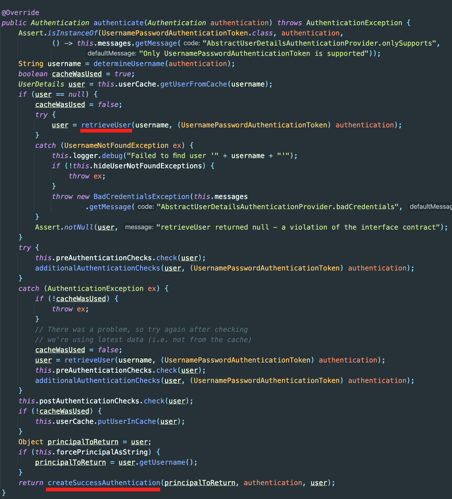

- 성공적으로 인증된 `Authentication`은 `SecurityContext` 객체 안의 `SecurityContext`에 저장됩니다.
  - 실패할 경우 예외 발생
  - `Principal`, `Credentials`, `Authorities`, `Authenticated` 저장
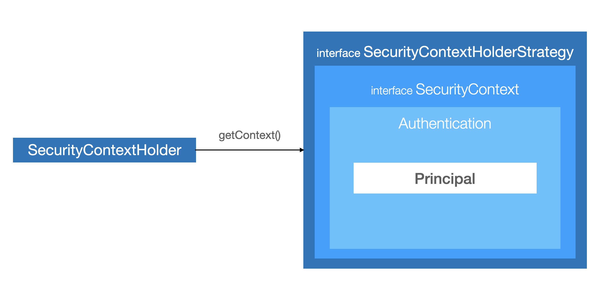
  - `SecurityContextHolder`는 `SecurityContext` 객체를 감싸는 wrapper 클래스로, 세 가지 저장 방식을 통해 `SecurityContext`를 저장합니다.
    - `MODE_THREADLOCAL`
    - `MODE_INHERITABLETHREADLOCAL`
    - `MODE_GLOBAL`
    - `SecurityContextHolderStrategy` 기본 전력은 `ThreadLocalSecurityContextHolderStrategy`로 Thread마다 `SecurityContext` 객체를 할당합니다. 따라서 사용자별로 각각 다른 `Authentication` 객체를 가질 수 있습니다.
  ```java
  private void setSecurityContext(Authentication authentication) {
    SecurityContext context = SecurityContextHolder.createEmptyContext();
    context.setAuthentication(authentication);
    SecurityContextHolder.setContext(context);
  }
  ```

  ```java
  Authentication authentication = SecurityContextHolder.getContext().getAuthentication();
  ```
  - `SecurityContext`는 접근 주체와 인증에 대한 정보를 담고 있는 Context로, 전역 객체여서 어느 곳에서나 참조가 가능하고 언제든지 `Authentication` 객체를 꺼낼 수 있습니다.

### Authorization

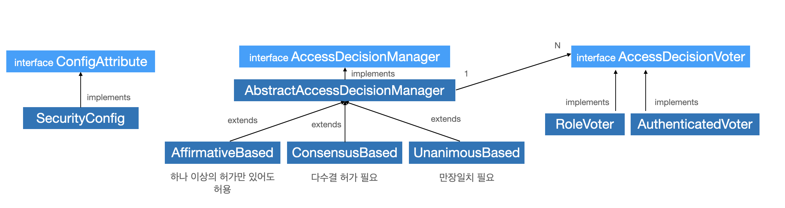

인증된 사용자가 특정 리소스에 접근할 때 접근 자격이 있는지 증명하는 것이 인가입니다.
Spring Security는 다음과 같이 3가지 권한 계층을 지원합니다.

1. 웹 계층
  - URL 요청에 따른 메뉴(화면) 단위 (e.g. `/settings`에 접근할 때 해당 리소스에 설정된 권한 `ROLE_ADMIN` 그리고 인증된 주체가 가진 권한을 비교)

2. 서비스 계층
  - 메서드 단위 (e.g. `user()` 메서드에 접근할 때 해당 메서드에 설정된 권한과 인증된 주체가 가진 권한을 비교)
  
3. 도메인 계층 (ACL)
  - 객체 단위 (e.g. 객체 `user`를 핸들링하려 할 때 도메인에 설정된 권한과 인증된 주체가 가진 권한을 비교)
  
`FilterSecurityInterceptor`가 인가 처리를 담당하는 필터로 Spring Security Filter Chain의 마지막에 위치하고 있습니다. 인증된 사용자에 대해 특정 요청의 승인 여부를 결정합니다.
```java
// AbstractSecurityInterceptor.java (Parent of FilterSecurityInterceptor)

private void attemptAuthorization(Object object, Collection<ConfigAttribute> attributes,
			Authentication authenticated) {
  try {
    this.accessDecisionManager.decide(authenticated, object, attributes);
  }
  catch (AccessDeniedException ex) {
    if (this.logger.isTraceEnabled()) {
      this.logger.trace(LogMessage.format("Failed to authorize %s with attributes %s using %s", object,
          attributes, this.accessDecisionManager));
    }
    else if (this.logger.isDebugEnabled()) {
      this.logger.debug(LogMessage.format("Failed to authorize %s with attributes %s", object, attributes));
    }
    publishEvent(new AuthorizationFailureEvent(object, attributes, authenticated, ex));
    throw ex;
  }
}
```

- 해당 필터는 HTTP 리소스 보안을 처리하는 필터로써 URL 방식으로 접근하는 경우 동작합니다.

- `Authentication` 객체 없이 보호된 리소스에 접근하면 `AuthenticationException`을 발생시킵니다.
- 인증되었으나 접근 가능한 권한이 없는 경우에는 `AccessDeniedException`을 발생시킵니다.
- 권한 처리를 `AccessDecisionManager`에 위임합니다.

- `AccessDecisionManager`는 내부적으로 `AccessDecisionVoter`의 Voting 전략에 따라 접근 가능여부를 판단합니다. (승인(`granted`) / 거부(`denied`) / 보류 (`abstained`))
  - 기본 전략은 `AffirmativeBased`로, 하나 이상의 Voter가 승인하는 경우 인가를 승인합니다.