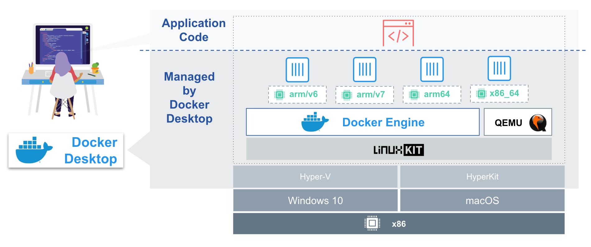
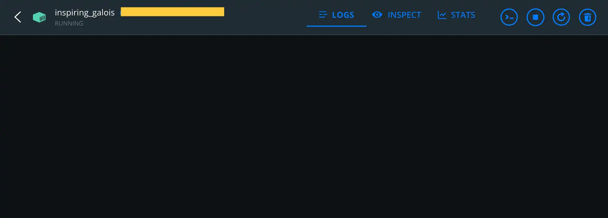

# Multi-Architecture Supported Docker Builds

## Overview

CPU 프로세서에는 x86/AMD, ARM 등 다양한 종류의 프로세서가 있으며 이들 프로세서는 각각 Instruction Set이 다릅니다. (AMD x86: CISC, ARM: RISC) 이기종 시스템 간에는 바이너리가 서로 호환되지 않습니다. 따라서 Binary Translation을 통해서 다른 플랫폼 명령어를 해독하는 작업이 필요합니다. 단일 도커 이미지는 멀티 아키텍처를 지원할 수 있습니다. 만약, ARM 기반 머신에서 x86 프로세서만을 지원하는 도커 이미지를 실행하면 어떤 일이 일어날까요?

M1 Pro 맥북을 사용하고 있는 저는 M1 (ARM) 을 기준으로 해서 설명을 드리고자 합니다.

## Docker vs Docker Desktop

도커는 기본적으로 리눅스 컨테이너 기술이기 떄문에, macOS나 Windows에서 도커 엔진을 곧바로 사용할 수 없습니다. 따라서 이들 OS에는 Docker Engine과 에뮬레이터, 경량 linux kernel이 포함된 Docker Desktop을 설치하여 대신 사용하게 됩니다.

도커의 경우 Host OS인 리눅스의 커널을 공유하여 컨테이너를 실행합니다. 따라서 컨테이너로 생성하기 위한 이미지는 Host OS와 동일한 아키텍처에서 빌드된 이미지로만 생성하고 실행할 수 있습니다.

반면에 Docker Desktop의 경우 컨테이너로 생성하는 이미지가 머신의 아키텍처와 다른 아키텍처에서 빌드된 이미지도 실행시킬 수 있습니다. 이는 Docker Desktop에 내장된 에뮬레이터가 이미지의 아키텍처와 동일한 환경을 조성시키고, 이 위에서 실행하도록 지원하기 때문입니다.



[출처] https://www.docker.com/blog/multi-arch-images/

*에뮬레이션은 하드웨어 리소스 동작을 소프트웨어로 대신하는 가상화 방식으로, 에뮬레이터 소프트웨어를 통해서 타겟 아키텍처의 환경을 흉내내게 됩니다.*

## Emulation Issue

M1 머신에는 x86 애플리케이션을 Binary Translation하여 실행할 수 있도록 Rosetta 2 에뮬레이터를 탑재하고 있습니다. Docker Desktop을 M1에 구성하고, x86 기반 이미지를 M1에서 실행하게 될 경우 Rosetta 2를 기본 에뮬레이터로 동작하도록 기본값이 지정되어 있으며, 기타 다른 아키텍처 기반의 이미지를 실행하는 경우는 내장된 qemu 에뮬레이터를 사용하게 되어 있습니다.

::: warning Rosetta 2
Big Sur 버전부터는 OS에 포함되어 있어 별도의 설치가 필요없으나, 이전 버전의 경우 커맨드를 통한 설치가 필요합니다.
```
softwareupdate --install-rosetta
```
:::

그런데, 간혹 에뮬레이션으로 실행되는 컨테이너가 정상적으로 동작되지 않는 경우가 있습니다. 아래 사례처럼 머신의 아키텍처와 다른 아키텍처 기반에서 빌드된 이미지를 실행한 결과입니다. 어떠한 로그 출력도 없이 그저 hang 상태로 지속되고 있음을 알 수 있고, GUI 클라이언트에서도 경고 메시지를 출력하면서 정상적인 퍼포먼스를 낼 수 없다고 알려주고 있습니다.




native 플랫폼과 다른 이미지를 실행시켰을 때 모든 경우에서 실행 오류가 발생하지는 않습니다. (ubuntu Official Image의 경우 원활하게 에뮬레이팅 되며 실행됨을 알 수 있었습니다.)

현재 도커 공식 문서에서는, Rosetta를 통한 x86 이미지 에뮬레이션 과정에서 확률적인 crash 현상이 나타나고 있음을 언급하고 있습니다. 따라서 production 환경에서 서비스를 운영하려 할 떄, 이러한 점을 고려할 필요가 있을 것 같습니다. Known Issues

이러한 이슈를 떠나서, production 환경에서 에뮬레이션을 이용한 서비스 실행은 퍼포먼스 측면에서 바람직하지 않습니다. 에뮬레이터를 통한 환경 조성에 들어가는 추가적인 리소스가 필요하기 때문입니다. 따라서 지원하고자 하는 아키텍처별로 멀티 플랫폼 빌드를 수행하는 것을 권장합니다.

## How to support multi-arch docker builds?

다중 아키텍처 환경을 지원하는 도커 이미지를 빌드하기 위해서는 `docker build --platform` 옵션을 사용해 특정 아키텍처를 지정하여 빌드할 수 있습니다. 다만 이러한 방식은 매 아키텍처별로 빌드하고 `docker manifest create`을 통해 manifest 정보를 생성해야 하는만큼 번거로움이 있습니다. 효과적인 멀티 아키텍처 빌드를 위해서 도커의 experimental feature인 `buildx` 플러그인과 Cross-compilation을 멀티 스테이지 빌드 방식으로 구성한 `Dockerfile` 정의를 함께 사용하는 방법을 개인적으로 선호합니다.

`buildx` 플러그인은 여러 다른 플랫폼 이미지를 지원하는 빌드 기능 등을 포함하는 CLI 확장 플러그인으로 19.03 버전부터 사용 가능합니다. Experimental Feature로 제공되어 해당 기능을 활성화할 필요가 있습니다.

다음과 같이 3가지 전략을 사용하여 다중 플랫폼 이미지를 빌드합니다.

1. 커널에서 qemu 에뮬레이션 support 사용
2. Builder Instance를 사용해 빌드
3. Dockerfile의 stage를 사용해 다른 아키텍처로 cross-compilation

`buildx는` `docker`와 `docker-container`라는 두 가지 드라이버 구성을 가지고 있으며 `docker-container` 드라이버를 사용하면 이미지 빌드시 BuildKit 라이브러리를 포함하는 도커 컨테이너를 생성합니다. 해당 컨테이너와의 통신을 통해 이미지를 빌드하게 됩니다.

```dockerfile
# Build Phase
FROM --platform=${BUILDPLATFORM} openjdk:17-alpine AS build

RUN `something compilation`

# Runtime Phase
FROM gcr.io/distroless/java17
COPY --from=build . .
ENTRYPOINT ["application.jar"]
```

## Conclusion

ARM 프로세서를 사용하는 디바이스가 점차 늘어나는 추세에 있는 것 같습니다. Apple에서 자체 칩을 ARM 기반으로 출시하고 있고 AWS 또한 Graviton 프로세서를 출시하는 등 많은 환경에서 ARM 아키텍처를 기반으로 하는 사례가 늘어나고 있는데요. 아키텍처가 상이함으로 인해서 도커 컨테이너를 실행할 때 위와 같은 시행착오를 많이 겪게 되실 것 같습니다. 이번 article이 작게 나마 도움이 되었으면 하는 바람입니다.